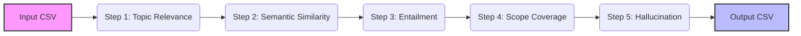

# Local LLM Evaluator in Python 🔍
A transparent, cost-aware evaluation harness for **end-to-end (E2E) output alignment **of chatbot responses - especially LLM-generated responses from RAG systems or fine-tuned LLMs.
Hugging Face models, enabling privacy-preserving evaluation at scale with zero API cost.

This project evaluates whether the **actual response** aligns with an **expected (golden) answer** using l**ocal Hugghig Face models** (embeddings, cross-encoders, and NLI). It is designed for regression testing, batch benchmarking and privacy-sensitive environment with zero API cost.

## 🚀 TL;DR 
- **Goal**: End-to-end evaluation of **Actual VS Expected** responses (golden dataset alignmnet)
- **Approach**: Deterministic metrics using **local NLP models**(no "LLM-as-a-judge" prompts)
- **Workflow**: CSV-in -> CSV-out, scalable for thousands of rows
- **Best for**: Regression testing & continuous improvement of chatbot answer quality
- **Key dimensions**: Relevance, Semantic Equivalence, Entailment (Claims), Scope Coverage (Under-generation), Unsupported additions (Over-generation)

## 📖 What "End-to-End Evaluation" Means Here? 
This evaluator measures quality **from the user's question to the final answer output**, without requiring access to internal bakend logic. 

For each test case (row), the evaluation compares:
- Question
- Expected Answer (golden answer/ reference)
- Actual Answer (chatbot output)

Optional field:
- Claims - atomic facts that must be satisfied (recommended for outcome-level correctness and alignment, not internal model behavior)

## ❓ Why This Project?
Evaluation of LLM oftern becomes either:

#### 1️⃣ Manual review
- **Subjectivity:** “Correct / incorrect” is often a matter of opinion among reviewers
- **Vagueness:** Evaluation dimensions are often implicit rather than defined
- **Scalability:** Human review is labor-intensive and slow

#### 2️⃣ LLM-as-a-judge
- **Cost concerns**: expensive at scale for paid LLM APIs
- **Black‑box decision process** (“the prompts decided monolithically”)
- **Difficulty explaining** why a result failed

#### ✅**This project provides a third option**
- Local metrics that are cost-effective 
- Deterministic outcome with explainability 
- Suitble for large-scale regression testing
Designed for regression testing using industry-aligned evaluation concepts to provide interested parties an other choice for affordable comparison automation.

## 🎯 When This Tools Fits (and When It Doesn't)
✅ Great fit
- You have a **golden dataset** (Expected answers)
- You want **repeatable E2E regression testing**
- You want **local execution for LLM evaluation** (privacy/ cost constraint)
- You care more about **content correctness**, not writing style 

## 🚫 Out of Scope (by Design)
This project focus on correctness-first evaluation. It does not assess:
- **Fluency/Style:** Better handled via system prompts or moderation guardrails.
- **Creativity:** Subjective quality that local models cannot reliably score.
- **Safety/Toxicity:** Requires specialized classifiers.

## 📊 Evaluation Mapping with Industry Standards
Here is the summary table of what industry standard consider VS the inclusion and implemetation in our project.

| Dimension | Industry Standard | Covered in This Project? | Implementation Logic |
| :--- | :--- | :--- | :--- |
| **Relevance** | ✅ Yes | ✅ Yes | **Step 1:** Embedding Cosine Similarity (Question ↔ Actual) |
| **Semantic Equivalence** | ✅ Yes | ✅ Yes | **Step 2:** Cross-Encoder (Expected ↔ Actual) |
| **Logical Correctness** | ✅ Yes | ✅ Yes | **Step 3/5:** NLI Entailment & Hallucination |
| **Entailment** | ✅ Yes | ✅ Yes | **Step 3:** Verification against user-provided atomic claims. |
| **Scope Control** | ✅ Yes | ✅ Yes | **Step 4:** NLI check ensuring expected contents are covered in actual ones. |
| **Unsupported Additions (Over-generation)** | ✅ Yes | ⚠️ Partial | **Step 5:** Flags "extra"/ "uncontrolled" info. |
| **Fluency / Style** | ✅ Yes | ❌ No | Intentionally excluded (focus is on content correctness). |
| **Safety / Toxicity** | ✅ Yes | ❌ No | Requires specialized models (e.g., Llama Guard). |
Note:  Unsupported addition is often colloquially called "hallucination" but in this repo it is measured relative to the Expected answer, not against external evidence.

## 🛠️ Key Design Choices
- No "LLM judge" prompts: avoids black-box prompt decisions
- Deterministic pipeline logic: stable results for regression comparisons
- Local models: no API calls, supports private datasets
- CSV-first architecture" easy integration with Excel/ Power BI/ CI pipelines
- Claims optional: you can run with or without manually authored atomic claims.


## 📂 Project Structure
- **`evaluator.py`**: Core evaluation engine `DimensionOutcomeEvaluator` class
- **`run_app.py`**: Orchestrator (CSV ingestion -> evaluation pipeline by -> CSV output) that manages the workflow. It uses the `load_data` function for CSV ingestion and the  function to execute the full AI pipeline.
- **`requirements.txt`**: `pip` dependencies
- **`environment.yml`**: `Conda` environment configuration
- **sample_test.csv**: sample input dataset
- **evaluation_result.csv**:generated sample output (after running)

## 🔍 How It Works: Waterfall Evaluation Pipeline
Each CSV row flows through a step-by-step evaluation pipeline:

**Workflow:**


## 🧠 Evaluation Methodology & Models Applied
The `DimensionOutcomeEvaluator` suite measures performance across five critical dimensions using local NLP models:

| Steps | Evaluation Dimension | Explanation | Involved NLP/ Embedding Models |
| :--- | :--- | :--- | :--- |
| 1 |**Topic Relevance** (Question <-> Actual)| Ensures the LLM output directly addresses the user's question |[ all-mpnet-base-v2](https://huggingface.co/sentence-transformers/all-mpnet-base-v2) |
| 2 |**Semantic Equivalence**  (Expected <-> Actual)|| CMeasure meaning-level alignment with the golden answer | [Cross-Encoder](https://huggingface.co/cross-encoder/stsb-roberta-large) 
| 3 | **Entailment** (Actual -> Claims) _(optional but recommended)_ | Verify if the required atomic facts are supported by actual answers| [roberta-large-mnli](https://huggingface.co/FacebookAI/roberta-large-mnli) |
| 4 | **Scope Coverage/ Undergeneration**  (Actual -> Expected)| Check if the actual answers missed expected content (constraints) | [roberta-large-mnli](https://huggingface.co/FacebookAI/roberta-large-mnli)  |
| 5 | **Unsupported Additions/ Overgeneration** (Expected -> Actual) | Flag content that goes beyond the expected answer |[roberta-large-mnli](https://huggingface.co/FacebookAI/roberta-large-mnli) |

You can change the models/ remove any parts of the steps based on your needs.

## ⏩ Quick Start

### What input is needed?
Based on the above methodology, a CSV input is required with the naming convention for the column names as below:
- Questions
- Expected Answers
- Actual Answers
Optional:
- Atomic Claims (JSON-array or delimiter-separated)

### 💻 Setup
- 1: Clone this repo.
  ```bash
  git clone https://github.com/marypyleung/local-llm-evaluator-python.git
  cd local-llm-evaluator-python
  ```
- 2: Install the required dependencies (via `Conda` or `pip`)
  - Via `Conda`:
    ```bash
    conda env create -f environment.yml
    conda activate llm-eval
    ```
  - Via `pip`:
    ```bash
    pip install -r requirements.txt
    ```
- 3: Run Evaluation
  ```bash
  python run_app.py
  ```


### 🏗️ The Evaluation Engine: `evaluator.py`
<details>
<summary>Click to expand for the core evaluation class and AI model logic</summary>
  
```python
# This file contains the core AI logic (NLI, Similarity, Relevance)

from sentence_transformers import SentenceTransformer, CrossEncoder, util
from transformers import pipeline
import json

class DimensionOutcomeEvaluator:
    """
    A comprehensive evaluation suite for LLM responses using local models.
    Measures performance across five dimensions: Relevance, Similarity, 
    Entailment (NLI), Scope Coverage (undergeneration), and Unsupported Additions (overgeneration).
    """


    def __init__(
        self,
        embed_model = "sentence-transformers/all-mpnet-base-v2",
        cross_encoder_model = "cross-encoder/stsb-roberta-large", 
        nli_model = "roberta-large-mnli",
        use_cross_encoder = True, 
        device = -1,   # -1 for CPU, 0 for GPU
    ):
        
        """Initializes AI models for embedding, cross-encoding, and NLI."""
        # 1. Embedding Model (Sentence-Transformer)
        self.embedder = SentenceTransformer(embed_model)

        # 2. Cross-Encoder (for high-precision semantic equivalence)
        self.use_cross_encoder = use_cross_encoder
        self.cross_encoder = CrossEncoder(cross_encoder_model) if use_cross_encoder else None

        # 3. NLI Model (Zero-shot logical inference)
        self.nli = pipeline(
            "text-classification",
            model=nli_model,
            device=device
        )

    # -------------------------
    # INTERNAL UTILITIES (The "Logical Brain")
    # -------------------------
    
    def _nli(self, premise, hypothesis):
        """
            Core Natural Language Inference (NLI) engine.
            
            This internal utility determines the logical relationship between two 
            text segments. It serves as the foundation for:
            - Step 3: Entailment (Fact-checking)
            - Step 4: Scope Coverage (Undergeneration)
            - Step 5: Hallunication (Grounding)
            
             Logic Flow inherited from label field of roberta-large-mnli model:
            - ENTAILMENT: The premise supports the hypothesis.
            - CONTRADICTION: The premise denies the hypothesis.
            - NEUTRAL: No logical relationship exists.
        """
        # Ensure inputs are strings to avoid model errors
        premise = str(premise or "")
        hypothesis = str(hypothesis or "")

        """
        The pipeline automatically handles dual-sentence formatting (e.g., </s></s>)
        using the 'text_pair' argument.
        """
        out_raw = self.nli(premise, text_pair=hypothesis)

        # Robust Parsing: HuggingFace pipelines return nested lists [[...]] when 
        # top_k=None is set. Unwrap this to access the dictionary.
        if isinstance(out_raw, list):
            data = [out_raw]
        elif isinstance(out_raw, list) and out_raw and  isinstance(out_raw[0], list):
            data = out_raw[0]
        else:
            data = out_raw if isinstance(out_raw, list) else []
  

        # Now can safely iterate over dictionaries
        try:
            # Map labels to scores and identify the winning label
            scores = {res['label'].upper(): res['score'] for res in data}
            label = max(scores, key=scores.get) 
            conf = scores.get(label, 0.0)
        except (TypeError, KeyError, ValueError):
            # Fallback for empty/malformed model outputs
            return {"label": "UNKNOWN", "confidence": 0.0, "scores": {}}
        
        return {
            "label": label,
            "confidence": round(conf, 3),
            "scores": {k: round(v, 3) for k, v in scores.items()}
        }
        

    # -------------------------
    # 1) Topic Relevance (Question vs. Actual Response)
    # -------------------------
    def topic_relevance(self, question, actual):
        """
        Measures how well the LLM response stayed on topic.
        Uses Cosine Similarity to compare the user's question with the AI's response.

        """
        q = str(question or "")
        a = str(actual or "")

        q_emb = self.embedder.encode(q, normalize_embeddings=True)
        a_emb = self.embedder.encode(a, normalize_embeddings=True)
        sim = float(util.cos_sim(q_emb, a_emb).item())

        if sim >= 0.70:
            result = "PASS"
        elif sim >= 0.50:
            result = "BORDERLINE"
        else:
            result = "FAIL"

        return {"relevance_result": result, "relevance_score": round(sim, 3)}

    # -------------------------
    # 2) Semantic Equivalence (Expected vs. Actual Response)
    # -------------------------
    def semantic_similarity(self, expected, actual):
        """
        Compare the AI's response against a 'Ground Truth' answer using high-accuracy Cross-Encoder.
        """
        if not self.use_cross_encoder:
            return {"level": "SKIPPED", "similarity": None}
        
        exp = str(expected or "")
        act = str(actual or "")
        
        # Cross-Encoders usually output a raw score (0-5 or 0-1 depending on model)
        raw = float(self.cross_encoder.predict([(exp, act)])[0])

        # Cross-Encoders usually output a raw score (0-5 or 0-1 depending on model)
        sim = raw / 5.0 if raw > 1.0 else raw
        sim = max(0.0, min(1.0, sim))

        if sim >= 0.70:
            result = "PASS"

        elif sim >= 0.50:
            result = "BORDERLINE"
        else:
            result = "FAIL"


        return {"similarity_result": result, "similarity_score": round(sim, 3)}


    # -------------------------
    # 3) Entailment Outcome (Fact-Checking)
    # -------------------------
    def entailment_outcome(self, actual, claims):
        """
        Verifies Actual Response against a specific list of factual claims
        
        Simplified Fact-Checker:
        - FAIL: If ANY claim is flat-out contradicted.
        - PASS: If ALL claims are entailed.
        - BORDERLINE: If some claims are neutral/missing (Partial knowledge).
        """

        # Handle the empty string/null cases from your CSV
        if not claims or (isinstance(claims, str) and not claims.strip()):
            return {
                "entailment_result": "SKIPPED",
                "count_claims_met": "0 of 0"
            }
        
        # Strict JSON Parsing
        if isinstance(claims, str):
            try:
                # json.loads is stricter and safer than ast.literal_eval
                claims = json.loads(claims.replace("'", '"')) 
            except (json.JSONDecodeError, ValueError):
                # If it's not valid JSON, skip it to ensure data integrity
                return {
                    "entailment_result": "SKIPPED",
                    "count_claims_met": "INVALID JSON FORMAT"
                }
            
        # Ensure a list of claims existed
        if not isinstance(claims, list):
            claims = [claims]

        total_count, entailed_count, contra_count = 0, 0, 0

        # Evaluation Loop
        for claim_text in claims:
            claim_text = str(claim_text).strip()
            if not claim_text:
                continue

            total_count += 1
            r = self._nli(actual, claim_text)
            
            if r["label"] == "ENTAILMENT":
                entailed_count += 1
            elif r["label"] == "CONTRADICTION":
                contra_count += 1

        # Verdict Logic
        if total_count == 0:
            result, count = "SKIPPED", "0 of 0"
        elif contra_count > 0:
            result, count = "FAIL", f"{entailed_count} of {total_count}"
        elif entailed_count == total_count:
            result, count = "PASS", f"{entailed_count} of {total_count}"
        else:
            result, count = "BORDERLINE", f"{entailed_count} of {total_count}"

        return {
            "entailment_result": result,
            "count_claims_met": count
        }
    
    # -------------------------
    # 4) Scope Coverage Indicator (Undergeneration)
    # -------------------------
    def coverage_indicator(self, expected, actual, conf_pass=0.70):
        """
        Logic: Actual -> Expected. 
        Checks if the 'Actual' response contains the information from the 'Expected' answer.
        FAIL: The AI missed something important from the Golden Answer (Undergeneration).
        """
        check = self._nli(str(actual or ""), str(expected or ""))
        if check["label"] == "ENTAILMENT" and check["confidence"] >= conf_pass:
            result = "PASS"
        elif check["label"] == "CONTRADICTION":
            result  = "FAIL"
        else:
            result  = "BORDERLINE"

        return {"coverage_result": result}

    # -------------------------
    # 5) Unsupported Additions (Overgeneration)
    # -------------------------
    def grounding_indicator(self, expected, actual, conf_pass=0.70):
        """
        Logic: Expected -> Actual.
        Checks if the 'Actual' response is strictly supported by the 'Expected' answer.
        FAIL: The AI made something up that wasn't in the Golden Answer (unsupported additions).
        """
        check = self._nli(str(expected or ""), str(actual or "")) 

        if check["label"] == "ENTAILMENT" and check["confidence"] >= conf_pass:
            result = "PASS"
        elif check["label"] == "CONTRADICTION":
            result = "FAIL"
        else:
            result = "BORDERLINE"

        return {"hallucination_result": result}
```
</details>

### ⚙️ Data Utilities & Execution Orchestrator: `run_app.py`
<details>
<summary>Click to expand for model execution </summary>

```python
# This file imports the engine and runs the CSV processing

import pandas as pd
from evaluator import DimensionOutcomeEvaluator

def load_data(file_path):
    """
    Loads CSV and returns a dictionary of lists for multi-dimensional analysis.
    Ensures that missing columns don't crash the script and fills NaNs.
    """
    df = pd.read_csv(file_path)
    df = df.fillna("")  # Critical: Prevents 'NoneType' errors in model encoding

    # Validation: Ensure core columns exist
    if not data_bundle["actual"]:
        raise ValueError("The CSV must at least contain an 'Actual Answers' column.")

    # Map your CSV column names to the internal keys here
    return {
        "questions": df['Questions'].tolist() if 'Questions' in df.columns else [],
        "expected": df['Expected Answers'].tolist() if 'Expected Answers' in df.columns else [],
        "actual": df['Actual Answers'].tolist() if 'Actual Answers' in df.columns else [],
        "claims": df['Claims'].tolist() if 'Claims' in df.columns else []
    }
    

def run_evaluation(input="sample_test.csv", output_path="evaluation_result.csv"):
    """
    Orchestrator script that generates results using Object and Utils together.
    """

    # 1. Initialize the "Object" (Engine)
    evaluator = DimensionOutcomeEvaluator(device=-1) # -1 for CPU, 0 for GPU
    results = []

    # 2. Load data 
    data_bundle=load_data(input)

    # Use the length of 'actual' as the master range
    num_rows = len(data_bundle["actual"])

    for i in range(num_rows):
        # Progress tracker
        print(f"🔄 Processing Question {i+1}/{num_rows}...")
        # 1. Safely extract inputs from bundle
        q = data_bundle["questions"][i] if i < len(data_bundle["questions"]) else ""
        exp = data_bundle["expected"][i] if i < len(data_bundle["expected"]) else ""
        act = data_bundle["actual"][i]
        claims = data_bundle["claims"][i] if i < len(data_bundle["claims"]) else None

        # 2. Run Engine Methods
        res_relevance = evaluator.topic_relevance(q, act)
        res_similarity = evaluator.semantic_similarity(exp, act)
        res_entailment = evaluator.entailment_outcome(act, claims)
        res_grounding = evaluator.grounding_indicator(exp, act)
        res_coverage = evaluator.coverage_indicator(exp, act)

        # 3. Construct the comprehensive row dictionary
        row_output = {
            # Original Inputs
            "question": q,
            "expected_response": exp,
            "actual_response": act,

            # Dimension 1 
            "relevance_result": res_relevance["relevance_result"],
            "relevance_score": res_relevance["relevance_score"],

            # Dimension 2
            "semantic_similarity_result": res_similarity["similarity_result"],
            "semantic_similarity_score": res_similarity["similarity_score"],
            
            # Dimension 3: Entailment (Critical Claims)
            "entailment_result": res_entailment.get("entailment_result", "ERROR"),
            "entailment_met": res_entailment.get("count_claims_met", "0 of 0"),
            
            # Dimension 4: Scope Coverage 
            "coverage_result": res_coverage["coverage_result"],
   
            # Dimension 5: Hallucination
            "hallucination_result": res_grounding["hallucination_result"]
        }
        results.append(row_output)
        
    # 4. Final Export
    df_results = pd.DataFrame(results)
    df_results.to_csv(output_path, index=False)
    print(f"✅ index: {output_path}")
    return df_results

if __name__ == "__main__":
    # You can specify your custom file names here
    run_evaluation()

```
</details>

## 🎬 Quick Demo of Use
A demo evaluates AI responses against findings from the United Nations ESCAP 2026 Theme Study: [Leaving no one behind: advancing a society for all ages in Asia and the Pacific](https://www.unescap.org/kp/2026/leaving-no-one-behind-advancing-society-all-ages-asia-and-pacific)
### To run the sample demo:
- 1: Ensure `sample_test.csv` is in the directory.
- 2: Execute: `python run_app.py`
- 3: View results in `evaluation_result.csv`.
