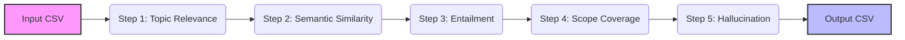

# Local LLM Evaluator in Python 🔍
This is a transparent, cost-aware evaluation harness for RAG-generated responses. By leveraging local Hugging Face models, this evaluator ensures data privacy and allows for thousands of evaluations with zero API costs.

## 🚀 TL;DR 
A cost-effective alternative to "LLM-as-a-judge." Use local NLP models to evaluate relevance, semantic equivalence, and logical entailment via a CSV-in → CSV-out workflow. Designed for large-scale regression testing where explainability and cost matter.

## ❓ Why This Project?
<details>
<summary>Click to expand: The problem with manual and LLM evaluation</summary>
  
### Traditional evaluation relies on manual review (not scalable) or LLM-as-a-judge (expensive "black box").

#### In LLM training and regression testing, evaluation often starts with manual comparison of expected vs actual answers. However, in practice this approach quickly breaks down:
- **Subjectivity:** “Correct / incorrect” is often a matter of opinion among reviewers.
- **Vagueness:** Evaluation dimensions are often implicit rather than defined.
- **Scalability:** For large datasets, human review is labor-intensive and slow.

#### This motivates the idea of using AI to evaluate AI to ask an LLM to act as a judge via a prompt. While this can be effective, it often introduces:
- **Cost concerns** when judging large datasets using paid LLM APIs
- A **black‑box decision process** (“the LLM decided monolithically**”)
- **Difficulty explaining** why a result failed

To cope with the dilemma, this project is attempting to download free library resources and apply them for evaluating LLM output performance with reference and alignment with industry standard to provide the interested parties an other choice for affordable comparison automation.
</details>

**This project offers:**
- **Zero Cost:** Runs locally on CPU/GPU—no OpenAI/Anthropic bills.
- **Transparency:** No "black box" prompts; results come from specific NLP models (RoBERTa/MPNet).
- **Determinism:** Same input, same score. Every time.

## 📊 Evaluation Mapping with Industry Standards
Here is the summary table of what industry standard consider VS the inclusion and implemetation in our project.

| Dimension | Industry Standard | Covered in This Project? | Implementation Logic |
| :--- | :--- | :--- | :--- |
| **Relevance** | ✅ Yes | ✅ Yes | **Step 1:** Embedding Cosine Similarity (Question ↔ Actual) |
| **Semantic Correctness** | ✅ Yes | ✅ Yes | **Step 2:** Cross-Encoder (Expected ↔ Actual) |
| **Logical Correctness** | ✅ Yes | ✅ Yes | **Step 3/5:** NLI Entailment & Hallucination |
| **Faithfulness (Entailment)** | ✅ Yes | ⚠️ Partial | **Step 3:** Verification against user-provided atomic claims. |
| **Scope Control** | ✅ Yes | ✅ Yes | **Step 4:** NLI check ensuring expected contents are covered in actual ones. |
| **Hallucination** | ✅ Yes | ⚠️ Partial | **Step 5:** Heuristic Entity Extractor flags "extra" info. |
| **Fluency / Style** | ✅ Yes | ❌ No | Intentionally excluded (focus is on content correctness). |
| **Safety / Toxicity** | ✅ Yes | ❌ No | Requires specialized models (e.g., Llama Guard). |


## 🛠️ Key Design Choices
- **The "No-Claims" Solution:** Uses bidirectional NLI (Actual ↔ Expected) to check logical implication even if you haven't defined manually written atomic claims.
- **Over-generation Warnings:** Flags extra entities as `WARNING` instead of a hard failure. This keeps humans in the loop for final verification.
- **CSV-First Architecture:** Built for data pipelines. One row in, one row out. Results are stored as JSON strings in CSV columns, ready for Excel or PowerBI.
- **Local & Deterministic:** You define your own local models (e.g., `all-mpnet-base-v2`) to produce consistent scores.


## 🚫 Out of Scope
Our goal is to provide a correctness-first tool for regression testing, not to replace human qualitative review. To preserve determinism and avoid subjective evaluation, we do not evaluate:
- **Fluency/Style:** Better handled via system prompts or moderation guardrails.
- **Creativity:** Subjective quality that local models cannot reliably score.
- **Safety/Toxicity:** Requires specialized, policy-driven classifiers.

## 📂 Project Structure
- **`evaluator.py`**: The "Engine" containing the core `DimensionOutcomeEvaluator` class.
- **`run_app.py`**: The "Orchestrator" that manages the workflow. It uses the `load_data` function for CSV ingestion and the `run_evaluation` function to execute the full AI pipeline.
- **`requirements.txt`**: Clean list of dependencies for `Pip`.
- **`environment.yml`**: Full environment configuration for `Conda`.

## 🔍 How the Script Works: The Evaluation Pipeline
The evaluator processes each row through a "Waterfall" architecture. Each step provides a different lens of truth:

**Workflow:**



## ⏩ Quick Start

### 💻 Setup
- 1: Clone this repo.
  ```bash
  git clone https://github.com/marypyleung/local-llm-evaluator-python.git
  cd local-llm-evaluator-python
  ```
- 2: Install the required dependencies (via `Conda` or `pip`)
  - Via `Conda`:
    ```bash
    conda env create -f environment.yml && conda activate llm-eval
    ```
  - Via `pip`:
    ```bash
    pip install -r requirements/requirements.txt
    ```
- 3: Run Evaluation
  ```bash
  python run_app.py
  ```

## Evaluation Framework & Methodology
The DimensionOutcomeEvaluator suite measures performance across six critical dimensions using local NLP models:

| Steps | Evaluation Dimension | Explanation | Involved NLP/ Embedding Models |
| :--- | :--- | :--- | :--- |
| 1 |**Topic Relevance**| Ensures the LLM output directly addresses the user's question |[ all-mpnet-base-v2](https://huggingface.co/sentence-transformers/all-mpnet-base-v2) |
| 2 |**Semantic Similarity** | Compares the Expected (Ground Truth) to the Actual Response for meaning-based alignment | [Cross-Encoder](https://huggingface.co/cross-encoder/stsb-roberta-large) |
| 3 | **Entailment** | Verify if the response is logically supported by specific Atomic Claims | [roberta-large-mnli](https://huggingface.co/FacebookAI/roberta-large-mnli) |
| 4 | **Scope Coverage** | Ensures the response covers expected content (constraints) | [roberta-large-mnli](https://huggingface.co/FacebookAI/roberta-large-mnli)  |
| 5 | **Hallucination** | Identifies over-generation/extra entities not present in the reference |[roberta-large-mnli](https://huggingface.co/FacebookAI/roberta-large-mnli) |

You can change the models/ remove any parts of the steps based on your needs.

## 🏗️ The Evaluation Engine: `evaluator.py`
<details>
<summary>Click to expand for the core evaluation class and AI model logic</summary>
  
```python
# This file contains the core AI logic (NLI, Similarity, Relevance)

from sentence_transformers import SentenceTransformer, CrossEncoder, util
from transformers import pipeline
import json

class DimensionOutcomeEvaluator:
    """
    A comprehensive evaluation suite for LLM responses using local models.
    Measures performance across five dimensions: Relevance, Similarity, 
    Entailment (NLI), Scope Alignment (Coverage), and Hallucination (Grounding).
    """


    def __init__(
        self,
        embed_model = "sentence-transformers/all-mpnet-base-v2",
        cross_encoder_model = "cross-encoder/stsb-roberta-large", 
        nli_model = "roberta-large-mnli",
        use_cross_encoder = True, 
        device = -1,   # -1 for CPU, 0 for GPU
    ):
        
        """Initializes AI models for embedding, cross-encoding, and NLI."""
        # 1. Embedding Model (Sentence-Transformer)
        self.embedder = SentenceTransformer(embed_model)

        # 2. Cross-Encoder (for high-precision semantic similarity)
        self.use_cross_encoder = use_cross_encoder
        self.cross_encoder = CrossEncoder(cross_encoder_model) if use_cross_encoder else None

        # 3. NLI Model (Zero-shot logical inference)
        self.nli = pipeline(
            "text-classification",
            model=nli_model,
            device=device
        )

    # -------------------------
    # INTERNAL UTILITIES (The "Logical Brain")
    # -------------------------
    
    def _nli(self, premise, hypothesis):
        """
            Core Natural Language Inference (NLI) engine.
            
            This internal utility determines the logical relationship between two 
            text segments. It serves as the foundation for:
            - Step 3: Entailment (Fact-checking)
            - Step 4: Scope Coverage (Undergeneration)
            - Step 5: Hallunication (Grounding)
            
             Logic Flow inherited from label field of roberta-large-mnli model:
            - ENTAILMENT: The premise supports the hypothesis.
            - CONTRADICTION: The premise denies the hypothesis.
            - NEUTRAL: No logical relationship exists.
        """
        # Ensure inputs are strings to avoid model errors
        premise = str(premise or "")
        hypothesis = str(hypothesis or "")

        """
        The pipeline automatically handles dual-sentence formatting (e.g., </s></s>)
        using the 'text_pair' argument.
        """
        out_raw = self.nli(premise, text_pair=hypothesis)

        # Robust Parsing: HuggingFace pipelines return nested lists [[...]] when 
        # top_k=None is set. Unwrap this to access the dictionary.
        if isinstance(out_raw, list) and len(out_raw) > 0 and isinstance(out_raw[0], list):
            data = out_raw[0]
        else:
            data = out_raw
  

        # Now can safely iterate over dictionaries
        try:
            # Map labels to scores and identify the winning label
            scores = {res['label'].upper(): res['score'] for res in data}
            label = max(scores, key=scores.get) 
            conf = scores.get(label, 0.0)
        except (TypeError, KeyError, ValueError):
            # Fallback for empty/malformed model outputs
            return {"label": "UNKNOWN", "confidence": 0.0, "scores": {}}
        
        return {
            "label": label,
            "confidence": round(conf, 3),
            "scores": {k: round(v, 3) for k, v in scores.items()}
        }
        

    # -------------------------
    # 1) Topic Relevance (Question vs. Actual Response)
    # -------------------------
    def topic_relevance(self, question, actual):
        """
        Measures how well the LLM response stayed on topic.
        Uses Cosine Similarity to compare the user's question with the AI's response.

        """
        q = str(question or "")
        a = str(actual or "")

        q_emb = self.embedder.encode(q, normalize_embeddings=True)
        a_emb = self.embedder.encode(a, normalize_embeddings=True)
        sim = float(util.cos_sim(q_emb, a_emb).item())

        if sim >= 0.70:
            result = "PASS"
        elif sim >= 0.50:
            result = "BORDERLINE"
        else:
            result = "FAIL"

        return {"relevance_result": result, "relevance_score": round(sim, 3)}

    # -------------------------
    # 2) Semantic Similarity (Expected vs. Actual Response)
    # -------------------------
    def semantic_similarity(self, expected, actual):
        """
        Compare the AI's response against a 'Ground Truth' answer using high-accuracy Cross-Encoder.
        """
        if not self.use_cross_encoder:
            return {"level": "SKIPPED", "similarity": None}
        
        exp = str(expected or "")
        act = str(actual or "")
        
        # Cross-Encoders usually output a raw score (0-5 or 0-1 depending on model)
        raw = float(self.cross_encoder.predict([(exp, act)])[0])

        # Cross-Encoders usually output a raw score (0-5 or 0-1 depending on model)
        sim = raw / 5.0 if raw > 1.0 else raw
        sim = max(0.0, min(1.0, sim))

        if sim >= 0.70:
            result = "PASS"

        elif sim >= 0.50:
            result = "BORDERLINE"
        else:
            result = "FAIL"


        return {"similarity_result": result, "similarity_score": round(sim, 3)}


    # -------------------------
    # 3) Entailment Outcome (Fact-Checking)
    # -------------------------
    def entailment_outcome(self, actual, claims):
        """
        Verifies Actual Response against a specific list of factual claims
        
        Simplified Fact-Checker:
        - FAIL: If ANY claim is flat-out contradicted.
        - PASS: If ALL claims are entailed.
        - BORDERLINE: If some claims are neutral/missing (Partial knowledge).
        """

        # Handle the empty string/null cases from your CSV
        if not claims or (isinstance(claims, str) and not claims.strip()):
            return {
                "entailment_result": "SKIPPED",
                "count_claims_met": "0 of 0"
            }
        
        # Strict JSON Parsing
        if isinstance(claims, str):
            try:
                # json.loads is stricter and safer than ast.literal_eval
                claims = json.loads(claims.replace("'", '"')) 
            except (json.JSONDecodeError, ValueError):
                # If it's not valid JSON, skip it to ensure data integrity
                return {
                    "entailment_result": "SKIPPED",
                    "count_claims_met": "INVALID JSON FORMAT"
                }
            
        # Ensure a list of claims existed
        if not isinstance(claims, list):
            claims = [claims]

        total_count, entailed_count, contra_count = 0, 0, 0

        # Evaluation Loop
        for claim_text in claims:
            claim_text = str(claim_text).strip()
            if not claim_text:
                continue

            total_count += 1
            r = self._nli(actual, claim_text)
            
            if r["label"] == "ENTAILMENT":
                entailed_count += 1
            elif r["label"] == "CONTRADICTION":
                contra_count += 1

        # Verdict Logic
        if total_count == 0:
            result, count = "SKIPPED", "0 of 0"
        elif contra_count > 0:
            result, count = "FAIL", f"{entailed_count} of {total_count}"
        elif entailed_count == total_count:
            result, count = "PASS", f"{entailed_count} of {total_count}"
        else:
            result, count = "BORDERLINE", f"{entailed_count} of {total_count}"

        return {
            "entailment_result": result,
            "count_claims_met": count
        }
    
    # -------------------------
    # 4) Scope Coverage Indicator (Under-generation)
    # -------------------------
    def coverage_indicator(self, expected, actual, conf_pass=0.70):
        """
        Logic: Actual -> Expected. 
        Checks if the 'Actual' response contains the information from the 'Expected' answer.
        FAIL: The AI missed something important from the Golden Answer (Under-generation).
        """
        check = self._nli(str(actual or ""), str(expected or ""))
        if check["label"] == "ENTAILMENT" and check["confidence"] >= conf_pass:
            result = "PASS"
        elif check["label"] == "CONTRADICTION":
            result  = "FAIL"
        else:
            result  = "BORDERLINE"

        return {"coverage_result": result}

    # -------------------------
    # 5) Grounding Indicator (Hallucination)
    # -------------------------
    def grounding_indicator(self, expected, actual, conf_pass=0.70):
        """
        Logic: Expected -> Actual.
        Checks if the 'Actual' response is strictly supported by the 'Expected' answer.
        FAIL: The AI made something up that wasn't in the Golden Answer (Hallucination).
        """
        check = self._nli(str(expected or ""), str(actual or "")) 

        if check["label"] == "ENTAILMENT" and check["confidence"] >= conf_pass:
            result = "PASS"
        elif check["label"] == "CONTRADICTION":
            result = "FAIL"
        else:
            result = "BORDERLINE"

        return {"hallucination_result": result}
```
</details>

## ⚙️ Data Utilities & Execution Orchestrator: `run_app.py`
<details>
<summary>Click to expand for model execution </summary>

```python
# This file imports the engine and runs the CSV processing

import pandas as pd
from evaluator import DimensionOutcomeEvaluator

def load_data(file_path):
    """
    Loads CSV and returns a dictionary of lists for multi-dimensional analysis.
    Ensures that missing columns don't crash the script and fills NaNs.
    """
    df = pd.read_csv(file_path)
    df = df.fillna("")  # Critical: Prevents 'NoneType' errors in model encoding

    # Map your CSV column names to the internal keys here
    return {
        "questions": df['Questions'].tolist() if 'Questions' in df.columns else [],
        "expected": df['Expected Answers'].tolist() if 'Expected Answers' in df.columns else [],
        "actual": df['Actual Answers'].tolist() if 'Actual Answers' in df.columns else [],
        "claims": df['Claims'].tolist() if 'Claims' in df.columns else []
    }
    
    # Validation: Ensure core columns exist
    if not data_bundle["actual"]:
        raise ValueError("The CSV must at least contain an 'Actual Answers' column.")


def run_evaluation(input="sample_test.csv", output_path="evaluation_result.csv"):
    """
    Orchestrator script that generates results using Object and Utils together.
    """

    # 1. Initialize the "Object" (Engine)
    evaluator = DimensionOutcomeEvaluator(device=-1) # -1 for CPU, 0 for GPU
    results = []

    # 2. Load data 
    data_bundle=load_data(input)

    # Use the length of 'actual' as the master range
    num_rows = len(data_bundle["actual"])

    for i in range(num_rows):
        # Progress tracker
        print(f"🔄 Processing Question {i+1}/{num_rows}...")
        # 1. Safely extract inputs from bundle
        q = data_bundle["questions"][i] if i < len(data_bundle["questions"]) else ""
        exp = data_bundle["expected"][i] if i < len(data_bundle["expected"]) else ""
        act = data_bundle["actual"][i]
        claims = data_bundle["claims"][i] if i < len(data_bundle["claims"]) else None

        # 2. Run Engine Methods
        res_relevance = evaluator.topic_relevance(q, act)
        res_similarity = evaluator.semantic_similarity(exp, act)
        res_entailment = evaluator.entailment_outcome(act, claims)
        res_grounding = evaluator.grounding_indicator(exp, act)
        res_coverage = evaluator.coverage_indicator(exp, act)

        # 3. Construct the comprehensive row dictionary
        row_output = {
            # Original Inputs
            "question": q,
            "expected_response": exp,
            "actual_response": act,

            # Dimension 1 
            "relevance_result": res_relevance["relevance_result"],
            "relevance_score": res_relevance["relevance_score"],

            # Dimension 2
            "semantic_similarity_result": res_similarity["similarity_result"],
            "semantic_similarity_score": res_similarity["similarity_score"],
            
            # Dimension 3: Entailment (Critical Claims)
            "entailment_result": res_entailment.get("entailment_result", "ERROR"),
            "entailment_met": res_entailment.get("count_claims_met", "0 of 0"),
            
            # Dimension 4: Scope Coverage 
            "coverage_result": res_coverage["coverage_result"],
   
            # Dimension 5: Hallucination
            "hallucination_result": res_grounding["hallucination_result"]
        }
        results.append(row_output)
        
    # 4. Final Export
    df_results = pd.DataFrame(results)
    df_results.to_csv(output_path, index=False)
    print(f"✅ index: {output_path}")
    return df_results

if __name__ == "__main__":
    # You can specify your custom file names here
    run_evaluation()

```
</details>

## 🎬 Quick Demo of Use
This demo evaluates AI responses against findings from the United Nations ESCAP 2026 Theme Study: [Leaving no one behind: advancing a society for all ages in Asia and the Pacific](https://www.unescap.org/kp/2026/leaving-no-one-behind-advancing-society-all-ages-asia-and-pacific)
### To run the sample demo:
- 1: Ensure `sample_test.csv` is in the directory.
- 2: Execute: `python run_app.py`
- 3: View results in `evaluation_result.csv`.
